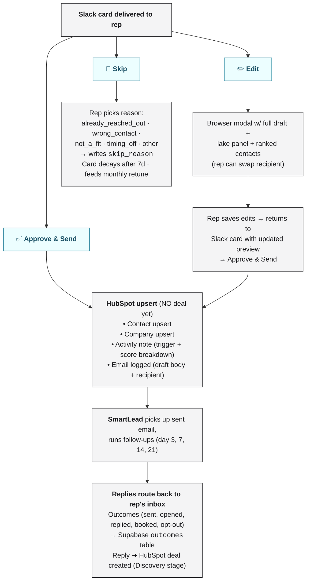

# Part 3 — Buying Signal Workflow

> Mento GTM Engineer Take-Home — *direct answer to the question, with the automation DAGs you can read in 30 seconds*

## What the brief asks

> *"Design and (to whatever extent you can) build an automated workflow that:*
> 1. *Monitors for one or more of these signals across a defined list of target accounts*
> 2. *Enriches the triggered account with relevant context (funding amount, headcount, key contacts)*
> 3. *Scores or prioritizes the signal (not all triggers are equal)*
> 4. *Routes the account to the right rep with a pre-populated, personalized outreach draft — but doesn't send it automatically"*

Plus: *what tools/APIs at each step, where AI vs. deterministic, where the human-in-the-loop is and why, and the piece you think is hardest to get right.*

---

## DAG #1 — The whole flow at a glance

```mermaid
flowchart TD
    A["<b>TARGET ACCOUNTS</b><br/>200-list + inbound with ICP ≥ 70"]

    A --> B["<b>1. MONITOR</b> — Trigger.dev tasks, one per signal source<br/>Crunchbase webhook (funding) · The Org + Crunchbase people (exec hires)<br/>Sumble (headcount + L&amp;D — primary) · Greenhouse + Lever + TheirStack (cross-checks)<br/>LinkedIn via Firecrawl · Glassdoor monthly · BlitzAPI alumni delta<br/>lake-side SQL (manager-density, lookalike, multi-signal)<br/>➜ writes row to <code>trigger_events</code> in Supabase"]

    B --> C["<b>2. ENRICH</b> — Trigger.dev job pulls fresh context<br/>BlitzAPI (firmographics + verified email/phone waterfall) · Crunchbase API (funding)<br/>The Org (org chart) · lake SQL (free signals)<br/>➜ caches <code>account_context</code> JSON"]

    C --> D["<b>3. SCORE / PRIORITIZE</b> — deterministic SQL<br/><code>trigger_score</code> + <code>icp_score × 0.5</code> = <code>priority_score</code><br/>➜ top-N daily queue per rep"]

    D --> E["<b>4. ROUTE</b> — deterministic rules<br/>prior touch · territory · round-robin · Alex-override at ≥ 95"]

    E --> F["<b>5. DRAFT</b> — Claude reads lake context, writes personalized email<br/>Inputs: trigger + account context + comparable-customer Avoma quote +<br/>buyer record + rep voice samples<br/>LLM-as-judge eval gate (≥ 0.85) before draft pings rep"]

    F --> G["<b>6. HITL</b> — agent pings rep in Slack with a rich card<br/>One-page brief: trigger, score breakdown, verified contact, draft preview<br/>Buttons: ✅ Approve &amp; Send · ✏️ Edit · 🚫 Skip"]

    G --> H["<b>7. APPROVE → CRM SYNC → SEQUENCER</b><br/>On approve: HubSpot upsert (contact + activity + email log) →<br/>SmartLead picks up the email and runs follow-ups<br/>Deal created on <i>reply</i>, not approve · Outcomes loop → Supabase"]

    classDef stage fill:#f4f4f5,stroke:#27272a,stroke-width:1px,color:#18181b;
    class A,B,C,D,E,F,G,H stage;
```



---

## (1) Monitor — which signals, which sources

The 4 signals from the brief, and the direct sources for each. **No signal rides on a single tool** — each gets a primary aggregator plus a cross-check, so a Sumble outage or a LinkedIn HTML change can't blind the system:

| Signal | Primary source | Cross-check / fallback |
|---|---|---|
| Series B/C/D funding | **Crunchbase Pro API** — webhook | **The Org** funding fields + Google News alerts (TechCrunch / press-release feed) |
| Headcount growth ≥ 20% in 180d | **Sumble** — aggregates hiring + headcount intent across 50K+ company career pages, LinkedIn, and the public web (one API, structured deltas) | **LinkedIn public company page** via Firecrawl + **Crunchbase Pro** employee-count tracking + **TheirStack** (job-volume proxy) |
| New CHRO / CPO / VP People hire | **The Org API** + **Crunchbase Pro people endpoint** — daily polls | **Sumble** people-changes feed + **LinkedIn** announcement post detection (Firecrawl on rep-followed exec pages) |
| L&D / "leadership development" job posting | **Sumble** — aggregator across public boards + cached career pages (catches Ashby, Workable, JazzHR, and bespoke careers pages that Greenhouse/Lever miss) | **Greenhouse + Lever public board APIs** (deeper structured data where applicable) + **TheirStack** (job-keyword search across crawled boards) |

**Why Sumble shows up twice:** for B2B signal coverage in 2026, Sumble's the cleanest aggregator for *both* hiring-volume (headcount proxy) and *job-posting content* (L&D keyword) — one API instead of stitching 4 board scrapers. LinkedIn + Crunchbase stay as the firmographic baseline. The Org stays for org-chart depth and exec-hire confirmation. Sumble fails or returns stale? The cross-checks still fire the signal — just one path slower.

Each source is hit by a **Trigger.dev** task that validates the payload, runs the two filter gates (account on 200-list OR ICP ≥ 70, then signal-scope), and writes a row to `trigger_events`. Crunchbase pushes to us; the others are daily polls. No VPS, no self-hosted scrapers — Trigger.dev runs the cron, Firecrawl runs any page fetch.

> **Plus 6 bespoke signals we'd add for alpha** — manager-density break, triple-event correlation in 90d, ex-customer alumni placement, Glassdoor career-growth drop, lookalike to named customers, exec post about manager development. Mostly computed via SQL on data we already have. Listed in the appendix; not load-bearing for this section.

**Filter vs. segment — why the bespoke 6 are the spine.** The 4 brief signals are the *filter* — they tell us an account is in the room. The bespoke 6 are the **operational situation** — what was actually true 6–18 months before Brex / Vercel / SoFi bought. Triple-event correlation in 90d (funding + headcount + exec-hire) isn't a generic trigger; it's the **new-CHRO-mandate archetype** from Part 2 catching fire in real time. As V1 ICP comes online (Part 2 §Q3), these stop being "alpha bolt-ons" and become the spine of the scoring — each bespoke signal maps to one archetype's discriminator. The filter says *who's in the room*; the segment says *who's in pain right now*.

---

## (2) Enrich — what context, which tools

When a row lands in `trigger_events`, a follow-on Trigger.dev job pulls fresh context:

| Pull | Tool / API | What it returns |
|---|---|---|
| Firmographic refresh | **BlitzAPI** | Headcount, industry, funding stage, recent funding date |
| **Verified contact discovery** | **BlitzAPI's contact-finding waterfall** | Best email + phone + role, prioritized: CHRO → VP People → L&D Lead → CFO. Email is verified, phone is mobile-preferred. |
| Funding details | **Crunchbase API** | Round size, lead investor, prior round date, total raised |
| Org chart context | **The Org API** | Director-layer headcount, recent exec changes, manager span |
| Free signal layer | **Lake SQL** | Glassdoor rating, lookalike score, ex-customer alumni link, exec-post evidence |

Output: `account_context` JSON cached in Supabase, read by the scorer, the drafter, and the Slack-card builder — so we pull each external API at most once per trigger.

---

## (3) Score / prioritize — the human version first, SQL underneath

### How a rep should think about it

> *"How well does this account look like the customers we've already won? How loud are the buying signals right now? Add a recency kicker. That's your score."*

Three numbers, one stack:

| Score | Plain-English question | Range | Source |
|---|---|---|---|
| **ICP score** | *"How much do they look like our best customers?"* | 0–110 | Part 2 (firmographics + bespoke boost) |
| **Trigger score** | *"How loud are the signals firing right now? Are there multiple at once?"* | 0–~200 | Part 3 (this section) |
| **Priority score** | *"What goes at the top of the rep's queue today?"* | computed | `trigger_score + (icp_score × 0.5)` |

**The alpha is in combinations.** A funding round on its own = warm. Funding + headcount jump + new CHRO in the same 90 days = a deal that's already happening, the rep just hasn't called yet. The scoring rewards combinations explicitly so those accounts can't get buried.

### How signals stack — the rep view

```
Signal stacking — what each signal is worth and why combinations win
─────────────────────────────────────────────────────────────────────
  Ex-customer placed at new account     ████████████████████  +50  (highest single — alumni open the door)
  New CHRO / CPO / VP People hired      ████████████████      +40  (the buyer just walked in)
  Series B/C/D funding                  ████████████          +30  (budget unlocked)
  Manager-density break (bespoke)       ██████████            +25  (org outgrew its leaders)
  L&D / "leadership dev" job posting    ████████              +20  (they're literally hiring for it)
  Headcount growth ≥ 20% in 180d        ██████                +15
  Lookalike to named customer           ██████                +15
  Exec post about manager development   ████                  +10
─────────────────────────────────────────────────────────────────────
  ≥ 3 signals fired in last 90 days     ████████████          +30  ← combinatorial bonus
  Triple-event (funding + headcount     ████████████████████  +50  ← THE alpha — single-deal predictor
    + exec-hire) all within 90 days
  Fired within last 7 days              ████                  +10  ← recency kicker
─────────────────────────────────────────────────────────────────────
```

### A note on SQL — what it is, what it isn't, and what it does here (and in Part 2)

**SQL = Structured Query Language.** The standard language for reading, writing, and computing on data inside a relational database. **Supabase is Postgres under the hood, and Postgres speaks SQL.** A SQL job in this doc is a *function* — math + data organization — running against tables that already live in Supabase. It reads from tables, does its work, and writes to a target table or view.

**Three lanes, no overlap:**

| Lane | What it does | Tools in this system |
|---|---|---|
| **Enrichment** (pulls data IN) | Goes to an outside source, fetches, lands it in a Supabase table | Crunchbase, BlitzAPI, The Org, Sumble, TheirStack, Firecrawl |
| **SQL** (organizes the data we already have) | Reads from Supabase tables, computes / joins / filters / scores, writes back to a Supabase table | Postgres queries in `mento-gtm/sql/` |
| **AI** (interprets) | Reads structured + unstructured content, produces meaning | Claude (draft generation, eval gate, score explanation, edge-case escalation) |

**SQL never fetches from outside.** That's enrichment. SQL only plays with rows already sitting in our tables. The Supabase boundary is the dividing line — crossing it = enrichment; staying inside = SQL.

**Every SQL job in this submission follows the same shape:** *reads from `[table]` → does `[the math / organization]` → writes to `[table or view]`.*

| Where it appears | What it reads | What it does | What it writes |
|---|---|---|---|
| **Part 2 §Q1 — dedupe detection** | `contacts` | Tiered match (email → LinkedIn → domain+name → phone), groups duplicates | `contacts_dedupe_groups` |
| **Part 2 §Q1 — merge job** | `contacts_dedupe_groups` + `contacts` | Picks winning value per field using merge precedence | `contacts_merged` |
| **Part 2 §Q3 — V0 ICP scoring** | `accounts` + `account_context` (enrichment fills these) | Weighted `CASE WHEN` math on firmographics + bespoke layer | `accounts.icp_score` |
| **Part 2 §Q3 — monthly weight re-fit** | `accounts` + `outcomes` (won/lost) | Logistic regression | New weight constants, proposed as PR |
| **Part 2 §Q4 — lifecycle transitions** | `contacts` + activity events | State machine logic with no-downgrade guarantee | `contacts.lifecycle_stage` |
| **Part 3 DAG #1 — lake-side signals** | `accounts` + `account_context` + activity history | Manager-density, lookalike, multi-signal correlation | `trigger_events` |
| **Part 3 §3 — trigger scoring (this section)** | `trigger_events` + `account_context` | Weighted `CASE WHEN` on signal types + combinations + recency | `trigger_score` |
| **Part 3 §3 — priority view** | `trigger_score` + `icp_score` | `trigger_score + (icp_score × 0.5)` | `v_priority_queue` |
| **Part 3 §7 — monthly trigger re-fit** | `trigger_events` + `outcomes` | Logistic regression | New trigger weights, proposed as PR |

**Why SQL, not AI, for any of this math:**
- **Deterministic** — same inputs produce the same output. An AI scorer drifts.
- **Auditable** — rep reads the query (or asks Claude Code to read it) and sees exactly why an account is #1 or why a contact got merged. No black box.
- **Cheap + fast** — milliseconds against indexed columns.
- **Versionable** — every query in `mento-gtm/sql/`, weight changes ship as PRs.

**Enrichment fetches, SQL organizes, AI interprets.** A rep can always trace any number on screen back to which lane produced it and which table it came from.

### The SQL underneath

```sql
trigger_score =
    -- single-signal weights
    CASE WHEN signal_type = 'series_bcd_funding'           THEN 30 ELSE 0 END
  + CASE WHEN signal_type = 'chro_or_vp_people_hire'       THEN 40 ELSE 0 END
  + CASE WHEN signal_type = 'manager_density_break'        THEN 25 ELSE 0 END
  + CASE WHEN signal_type = 'ex_customer_alumni_placement' THEN 50 ELSE 0 END
  + CASE WHEN signal_type = 'l_and_d_job_posting'          THEN 20 ELSE 0 END
  + CASE WHEN signal_type = 'headcount_growth_20pct'       THEN 15 ELSE 0 END
  + CASE WHEN signal_type = 'exec_post_manager_dev'        THEN 10 ELSE 0 END
  + CASE WHEN signal_type = 'lookalike_to_named_customer'  THEN 15 ELSE 0 END

    -- combinatorial bonus (the alpha — combinations beat any single event)
  + CASE WHEN account_signal_count_last_90d >= 3            THEN 30 ELSE 0 END
  + CASE WHEN funding_within_90d
         AND headcount_growth_within_90d
         AND exec_hire_within_90d                           THEN 50 ELSE 0 END

    -- recency
  + CASE WHEN fired_at > NOW() - INTERVAL '7 days'          THEN 10 ELSE 0 END;

priority_score = trigger_score + (icp_score * 0.5);
-- top-10 per rep per day = the prioritized queue
```

**The scale, in plain terms.** `trigger_score` floors at 10 (single weak signal + recency) and ceilings around **200** (triple-event + alumni + recency + the combinatorial bonus stacking). Add `icp_score × 0.5` (up to **+55**) and `priority_score` ceilings around **~255**, but in practice 95% of rows land in **0–180** and anything **≥ 150** is a "drop everything else" account. So `priority 170` ≈ *"top 5% of accounts the system has ever scored — go now."*

**Test before we trust the SQL:** before this scoring runs against live signals we **backtest the weights against Mento's last 18 months of won + lost deals**: replay every trigger that fired pre-close, score each, check that won-deal accounts cluster above lost-deal accounts and that the top decile correlates with closed-won. If the weights don't separate the two distributions cleanly (AUC ≥ 0.75), they're wrong and we tune before shipping. **The SQL is deterministic; the weights are evidence-fit.** Monthly logistic regression in Automation #7 keeps them tuned over time — proposed weight changes ship as a PR, never auto-merged.

**Where this scoring lives:** the SQL above runs as a **Postgres view** (`v_priority_queue`) refreshed on every `trigger_events` insert. The Slack card builder, the routing logic, and the rep dashboard all read from that view. Enrichment writes (BlitzAPI contacts, Crunchbase round details, The Org chart) land in `account_context` *before* the score is computed, so every priority number reflects fully-enriched data — never a half-pulled record. From the view, the next step writes a HubSpot deal note on approve, and SmartLead picks up the email. **One source of truth for "what's hot," everything downstream reads it.**

**Why deterministic, not agentic:** rep must be able to ask *"why is this account #1 in my queue this morning?"* and get a SQL-explainable answer. Black-box scoring kills trust the moment a rep disagrees with a result they can't audit.

**Where the agent fits:** **explanation only.** A small Claude call reads the contributing fields and writes the 1-paragraph explainer that goes in the Slack card — *"#1 because triple-event correlation fired (Series B Apr 14, 23% headcount growth, CHRO hired Mar 2) and they're a Vercel-shaped fintech (lookalike 0.81)."*

---

## (4) Route — deterministic rules

1. **Prior touch** → owns it (HubSpot deal association or last-activity rep)
2. **Territory match** → territory owner
3. **Else** → round-robin between Mento's 2 reps
4. **Override:** `priority_score ≥ 95` → Alex first (founder-led at top fit)

---

## (5) Draft — the only place AI is load-bearing

This is the piece templates can't do. Inputs the agent reads:

- **Trigger payload** — what fired, when, structured details
- **Account context** — firmographics, lookalike score, alumni link, prior touch history, lifecycle stage
- **Lake content** — best Avoma quote from a comparable won-customer's discovery call (matched on cohort + signal type), Slack-thread patterns from prior wins
- **Buyer record** — role, tenure, recent LinkedIn activity (last 30d), verified email + phone from BlitzAPI
- **Rep voice samples** — past emails *that closed* deals, scraped from the rep's connected mailbox via Gmail API

Output schema:
```json
{
  "subject": "...",
  "body": "...",
  "evidence_used": ["avoma:brex_2024_q3_call", "trigger:series_b_apr14"],
  "comparable_customer": "brex",
  "voice_match_score": 0.91
}
```

**Why agentic, not template:**
- Templates can't pick the right precedent (*"looks like Brex"* vs. *"looks like Vercel"*)
- Templates can't pull a real Avoma quote tied to the specific trigger
- Templates can't reason about multi-signal combinations (one event ≠ three events)
- Templates can't adjust register for cold vs. mid-funnel contacts
- Templates can't match a specific rep's voice (Alex writes differently than Rep #2)

**Eval gate before any draft pings the rep:** LLM-as-judge against held-out won-deal emails from the lake's `email_threads` table, scored on: voice match, trigger specificity, lake-evidence grounded, length < 120 words, no AI tells. **Drafts scoring < 0.85 retry with feedback before being shown to the rep.**

---

## (6) HITL — Slack-direct, not Gmail

**Where:** the rep's Slack — DM from the `@mento-signals` bot (or in `#signals-<rep-slug>` if they prefer a channel). Reps already live in Slack. They check it 100× a day. Gmail draft folder gets ignored; a Slack ping with a rich card doesn't.

### DAG #2 — what the rep actually sees in Slack

```
┌─────────────────────────────────────────────────────────────────────────┐
│  @mento-signals  ·  09:21                                               │
│  ─────────────────────────────────────────────────────────────────────  │
│  🔥  PRIORITY 170  ·  Glimmer Health  (alex_owner)                      │
│                                                                         │
│  Triple-event fired in 90d:                                             │
│   • Series C (Apr 14, $80M, lead: a16z)                                 │
│   • +220 headcount (180d, +23%)                                         │
│   • New CHRO Mar 2 (Marisol Hwang, ex-Brex)                             │
│  Lookalike 0.81 → Brex                                                  │
│                                                                         │
│  Verified contacts (BlitzAPI ✓ — ranked by buyer fit):                  │
│   1. Marisol Hwang · CHRO  (primary — draft is to her)                  │
│      marisol@glimmer.health  ·  +1-415-555-0144 (mobile)                │
│   2. James Okafor · VP People                                           │
│      james@glimmer.health  ·  +1-415-555-0188                           │
│   3. Priya Shah · Head of L&D                                           │
│      priya@glimmer.health  ·  +1-415-555-0176                           │
│   4. Daniel Kim · CFO  (budget owner — fallback)                        │
│      daniel@glimmer.health                                              │
│                                                                         │
│  Draft preview (to Marisol):                                            │
│   ┌───────────────────────────────────────────────────────────────────┐ │
│   │ Subject: Quick note — saw your team grew by ~220 this year        │ │
│   │                                                                   │ │
│   │ Marisol — congrats on Glimmer's Series C and the CHRO seat.       │ │
│   │ When Brex grew through a similar inflection in '23, their VP      │ │
│   │ People told us on a discovery call that their biggest blocker     │ │
│   │ was "we promoted 40 ICs into managers in 9 months and most        │ │
│   │ of them have never had a manager who coached them." That's the    │ │
│   │ exact gap we close in the first 30 days...                        │ │
│   │  [+ 60 more words]                                                │ │
│   └───────────────────────────────────────────────────────────────────┘ │
│  evidence_used: brex_2024_q3_call, series_c_apr14, chro_hire_mar02      │
│  voice_match: 0.94  ·  eval_score: 0.91                                 │
│                                                                         │
│  Open in: [HubSpot] [Lead profile] [Trigger detail] [Avoma] [Sequence]  │
│                                                                         │
│  [ ✅ Approve & Send → SmartLead seq ]  [ ✏️ Edit ]  [ 🚫 Skip… ]       │
└─────────────────────────────────────────────────────────────────────────┘
```

**Why this card shape:**
- **One-page brief.** Rep makes the call in 20 seconds without leaving Slack. Speed-to-lead matters — every hour after the trigger fires costs reply rate.
- **Score breakdown first** — tells them *why* this account is at the top.
- **Multiple verified contacts, ranked.** Reps complain when they get one contact and that contact is wrong / OOO / a CFO when they wanted a People leader. We give the top 3–4 buyer-fit contacts in priority order, all BlitzAPI-verified. Draft is to the primary; rep can edit-recipient with one click.
- **Draft preview, not draft hidden behind a click** — they can read it inline.
- **Deep links to CRM, lead profile, trigger detail, Avoma transcript, the SmartLead sequence** — every claim in the card is one click from the source. No black box.
- **Three buttons, clear consequences:**
  - **Approve & Send →** drops the email into the rep's connected mailbox via SmartLead. SmartLead's pre-built follow-up sequence runs steps 2–7 if no reply.
  - **Edit** — opens browser modal with full draft + lake panel (Avoma, prior wins, all 4 contacts). Rep edits, returns to Slack card, approves.
  - **Skip…** — opens a tiny dropdown: *"already reached out / wrong contact / not a fit / timing off / other"*. Required field — no naked skips. Logs to `skip_reason`. Card decays after 7 days. Skip reasons feed monthly weight retraining.

### DAG #3 — what happens when the rep clicks each button



**Why Slack, not Gmail draft folder:**
- Reps will see a Slack ping. They will not see a Gmail draft (drafts are invisible until you open compose).
- Slack lets us put the *score breakdown + verified contact + deep links* alongside the draft. A Gmail draft is just an email.
- Approve/Edit/Skip as buttons gives us clean training signal — every choice is logged. A Gmail draft sent gives us the same signal as a Gmail draft deleted (i.e. nothing).
- **Edit = training signal.** Diff between agent draft and rep-edited version is the highest-quality data we get for retraining the drafter.

**Why not earlier (e.g., trigger approval before drafting):** approval fatigue. Reps will ignore it. Trust comes from seeing a *good draft*, not a *good trigger*.

**Why not later (auto-send):** one bad email destroys the workflow's trust. The cost of a missed trust moment > the cost of a 20-second rep review.

---

## (7) Approve → CRM sync → Sequencer

### DAG #4 — the post-approval pipe

```mermaid
flowchart TD
    A["<b>APPROVE</b> clicked in Slack"]

    A --> B["<b>HubSpot sync on APPROVE</b> (one transaction — NO deal yet)<br/>• Contact upsert — Marisol Hwang, CHRO, verified email<br/>• Company upsert — Glimmer Health, post-enrichment<br/>• Activity note — full trigger payload + score breakdown<br/>• Email logged — drafted email body + recipient<br/><i>Deal is NOT created here — outbound send ≠ pipeline</i>"]

    B --> C["<b>SmartLead handoff</b> — drop straight into a sequence<br/>• Contact added to <code>Signal-Triggered — &lt;signal_type&gt;</code> campaign<br/>  (one campaign per signal type, pre-tuned for buyer + signal context)<br/>• Step 1 = the approved draft, sent from rep's connected mailbox<br/>• Steps 2–5 = follow-ups (day 3, 7, 14, 21), pre-built per campaign<br/>• Reply / booked / opt-out → contact pulled OUT of sequence via webhook<br/>• Slack card <code>Sequence</code> link deep-links to the running campaign"]

    C --> D["<b>Reply or booked-meeting → THEN deal gets created</b><br/>SmartLead webhook fires on reply / booked<br/>➜ HubSpot deal create: stage = <code>Discovery</code>, source = <code>&lt;signal_type&gt;</code><br/>associated to contact + company already upserted<br/><i>This is when the account earns a pipeline record</i>"]

    D --> E["<b>Outcomes loop</b><br/>• SmartLead → Supabase <code>outcomes</code> table<br/>  (sent, opened, replied, booked, opt-out)<br/>• Monthly: logistic regression on <code>trigger_events × outcomes</code><br/>  → re-fit weights<br/>• New weights ship via <b>PR (human review)</b>, never auto-pushed"]

    classDef stage fill:#f4f4f5,stroke:#27272a,stroke-width:1px,color:#18181b;
    classDef trigger fill:#ecfeff,stroke:#0e7490,stroke-width:1px,color:#164e63;
    class A trigger;
    class B,C,D,E stage;
```



**Why no deal on approve, deal on reply:**
- An approved cold email is *intent to outbound*, not pipeline. Creating a deal on every approve floods the pipeline with rows that haven't earned a stage. Forecasting becomes noise.
- A reply (or a booked meeting) is the first earned signal — *this account is engaging*. That's when a deal record is justified.
- Until then we have everything we need to attribute later: contact upserted, activity logged, email logged, trigger row in Supabase. We can always *create* the deal retroactively from those records — but we can't easily *unmess* a polluted pipeline.

**One thing the rep doesn't have to do:** lookups. Verified email, phone, role, tenure, prior touches — all in the Slack card. Rep approves; the CRM contact + activity get written clean and complete. The deal waits for the reply.

---

## AI vs. deterministic — explicit

| Component | AI or deterministic | Why |
|---|---|---|
| Trigger detection (webhooks + cron) | **Deterministic** | Reliability. AI here is overkill. |
| Lake-side signal SQL (manager density, lookalike, multi-event) | **Deterministic** | Same SQL the rep can read. |
| Enrichment orchestration | **Deterministic** (Trigger.dev) | Reliability + retries. |
| Trigger scoring | **Deterministic** (SQL) | Transparency. Rep audit. |
| Routing | **Deterministic** (rules) | Same. |
| Score-explanation paragraph | **AI** (small Claude call) | Communication, not math. Goes in the Slack card. |
| **Edge-case escalation** (45–69 ICP + strong qualitative signal) | **AI** | Pattern recognition is what agents are good at. |
| **Draft generation** | **AI** (Claude Opus) | Pattern matching + voice — the only load-bearing AI. |
| **Draft eval gate** | **AI** (LLM-as-judge) | Self-review before human review = better drafts, fewer rep edits. |
| **Skip-reason classification** | **AI** | Lightweight LLM call on the queue context. |
| Slack card delivery | **Deterministic** (Slack Block Kit) | Templated layout. |
| HITL approval | **Human** | Trust + voice fidelity. |
| HubSpot CRM sync on approve | **Deterministic** (HubSpot API) | Clean writes. |
| Sequencer follow-ups | **Deterministic** (SmartLead) | Operational. |
| Outcome attribution | **Deterministic** (webhook → SQL) | Auditable. |

---

## The piece I'd actually build (per the brief: *hardest to get right*)

**The draft generator with the eval gate.** Crunchbase webhooks, SQL scoring, routing rules, Slack Block Kit cards, HubSpot upserts, SmartLead handoff — all plumbing. Wire-able in a day each.

**Generating an email that sounds like Alex wrote it, references a real Avoma quote from a comparable Mento customer, ties to the specific signal that fired, reads the lifecycle correctly, and passes an automated voice-match check before the rep ever sees it — that's the work and the differentiation.**

```python
# src/generate_draft.py — pseudocode shape; full version in repo
def generate_draft(account_id: str, trigger_event: TriggerEvent) -> Draft:
    context  = lake.account_context(account_id)
    rep_id   = routing.rep_for(account_id)
    contact  = lake.best_contact(account_id)                    # CHRO > VP People > L&D > CFO

    comparable    = lake.most_similar_won_customer(account_id)  # cohort match: Brex / Vercel / Dropbox / ...
    avoma_quote   = lake.best_avoma_quote(comparable, trigger_event.signal_type)
    voice_samples = lake.rep_voice_samples(rep_id, outcome="closed_won", limit=12)

    prompt = build_prompt(
        trigger        = trigger_event,
        context        = context,
        contact        = contact,
        comparable     = comparable,
        avoma_quote    = avoma_quote,
        voice_samples  = voice_samples,
        max_words      = 120,
    )

    draft = claude.complete(prompt, model="claude-opus-4-7")

    # ── eval gate ── LLM-as-judge against held-out won emails ──────────
    score = eval_judge(draft, rubric=[
        "voice_match_to_won_emails",
        "trigger_specificity",          # references the actual signal, not generic
        "lake_evidence_grounded",       # cites real lake content (Avoma / customer)
        "length_under_120_words",
        "no_ai_tells",                  # anti-slop check
        "buyer_role_appropriate",       # CHRO ≠ L&D Lead voice
    ])
    if score < 0.85:
        draft = retry_with_feedback(draft, score, max_retries=2)

    # ── ship to rep via Slack, NOT Gmail ────────────────────────────────
    slack.post_signal_card(
        rep_id        = rep_id,
        account       = context,
        contact       = contact,
        trigger       = trigger_event,
        score_break   = scoring.explain(account_id, trigger_event),
        draft         = draft,
        eval_score    = score,
        deep_links    = links.for_account(account_id),  # HubSpot, lead, Avoma, trigger detail
    )

    log_to_supabase(draft, score, trigger_event)
    return draft


# src/on_slack_approve.py
def on_slack_approve(card_id: str, rep_id: str):
    card = slack.fetch_card(card_id)

    # 1. CRM sync on APPROVE — contact + company + activity + email log
    #    NO deal yet. Deal waits for a reply (handled in src/on_smartlead_reply.py).
    hubspot.upsert_contact_and_company(
        contact = card.primary_contact,
        company = card.account,
        note    = format_trigger_note(card.trigger, card.score_break),
        email   = card.draft,
    )

    # 2. Drop the contact into the signal-typed SmartLead sequence
    #    (one campaign per signal_type, pre-tuned for that buyer + signal).
    #    Step 1 = the approved draft. Steps 2–5 = pre-built follow-ups.
    smartlead.add_lead_to_campaign(
        campaign  = f"signal-triggered--{card.trigger.signal_type}",
        rep_id    = rep_id,                            # uses rep's connected mailbox
        contact   = card.primary_contact,
        step_1    = card.draft,                        # overrides default step 1
        variables = build_template_vars(card),         # for follow-ups 2–5
    )

    # 3. Log approval as training signal (and capture rep edits if any)
    log_outcome(card_id, "approved", diff=card.edit_diff)


# src/on_smartlead_reply.py — fires on SmartLead "reply" or "meeting_booked" webhook
def on_smartlead_reply(event: SmartLeadEvent):
    # First earned signal → THIS is when a deal record is justified.
    hubspot.create_deal(
        contact_id = event.hubspot_contact_id,
        company_id = event.hubspot_company_id,
        stage      = "Discovery",
        source     = event.signal_type,
        amount     = None,                 # rep fills in after qualification
        properties = {
            "trigger_event_id": event.trigger_event_id,
            "first_reply_at":   event.replied_at,
        },
    )
    log_outcome(event.card_id, "replied", reply_body=event.body)
```

The eval is the underrated piece. Without it, drafts vary in quality and reps lose trust. With it, every draft the rep sees has already passed a voice-match check against actual won-deal emails — so the floor on draft quality is "indistinguishable from a good rep email," not "an AI tried."

---

## What I'd architect but not build in a 2–3 hour window

Everything below the draft generator is named, sketched, and tool-decided — but not implemented end-to-end:

- **Trigger.dev tasks for each signal source** — one task per signal, written to a real `trigger_events` table. Wire-able fast; not the hard part.
- **Slack Block Kit card builder** — template + interactivity handlers (approve/edit/skip). Standard Slack app pattern.
- **HubSpot upsert pipeline** — contact + company + deal + activity note in one transaction on approve.
- **SmartLead webhook handler** — listens for sent → opened → replied → booked, writes to `outcomes`. Closes the loop on attribution.
- **The signal-discovery alpha-finder** — a script that reverse-engineers wins (90 days before each closed-won, what was true?) and surfaces statistically-significant pre-win patterns. *Spec'd, not run, since the lake here is synthetic.*
- **Closed-loop weight tuning** — monthly logistic regression on `trigger_events` × `outcomes` re-fits both the trigger weights and the ICP weights. Keeps the system honest over time. Ships as a PR for human review, never autopushed.

These are real, named with tools and example payloads. The *hardest* piece — drafting + eval — is what gets working code.
